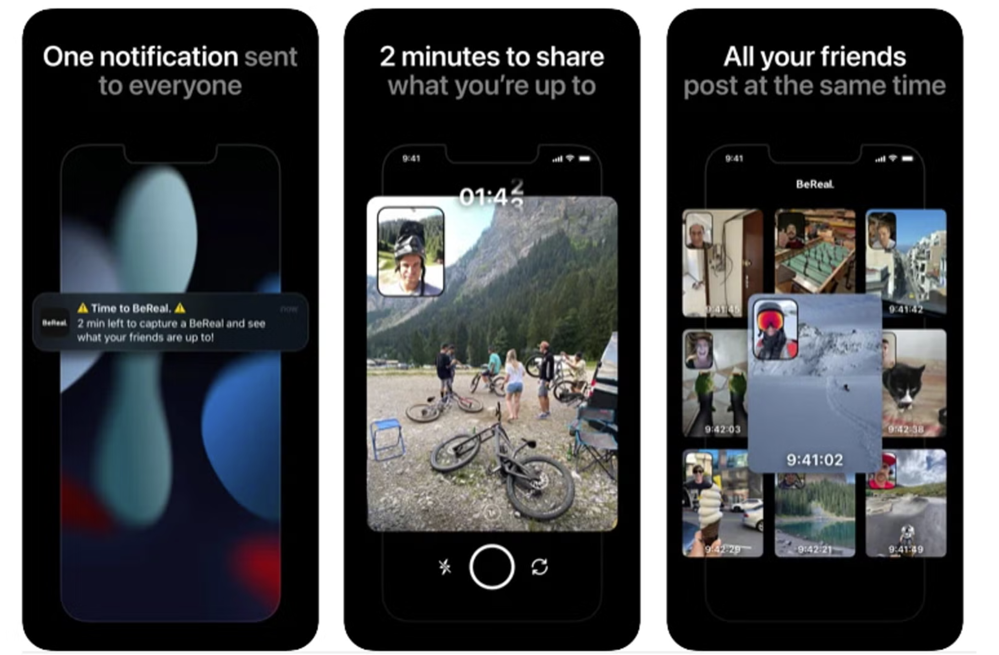

# Assignment 2

## Design Document

### Name and Audience

For this project, my main audience is going to be 13-25 years old who want to socialize/chat about some topic but it is open to everyone. The goal is to create a website where people are able to share and socialize about something they are a fan off or have in common. For example, you are a fan of a streamer and you want to share some fanart, or you want to find a gaming group. In addition, it should serve as a safe place for people to find and form small groups/communities, in the same vein of a group of friends. In a way, to lower the barrier of entry to reach out to other people and be able to start random casual conversantions.

Finally, the code name of this project is **MeetOut**.

---

### Comparables

{:width="300"}

__**Conversations in a table/desk in Gather Town**__: Could we assign certain spaces dedicated specially for reaching out to people and engage/start causal conversations?

{:width="300"}

__**Personal Costumizable Rooms in Club Penguin**__: Could we augment the normal user profile with more user creative costumization and a place to hang out with other users?

{:width="300"}

__**Community-made White Board in r/place in Reddit**__: Could we make a board where users can contribute/collaborate on drawings and built on top of works done by other users as another form of interactive communication?

{:width="300"}

__**Warning/Reminder pop-ups in Instagram**__: Could we apply these types of reminders on subjects about dangers like grooming and/or sensitive topics and give advice on how to avoid or prevent these type of situtations?

{:width="300"}

__**Public Servers in Discord**__: Could we create a similar system for searching on different servers/groups but for smaller groups, categorized by interest, topic, game, etc.?

{:width="300"}

__**Limited Time Engagement in BeReal**__: In BeReal, originally you only had 1 minute to able to post one selfie every day. Could we apply this type of limit with more time, so people are more meticulous with the time they have?

{:width="300"}

__**Costumized lobbies in VRChat**__: Could we use this idea to give users the ability to customized their environments for their servers/communities so it fits with their niche?

---

### Feature Design Ideas

