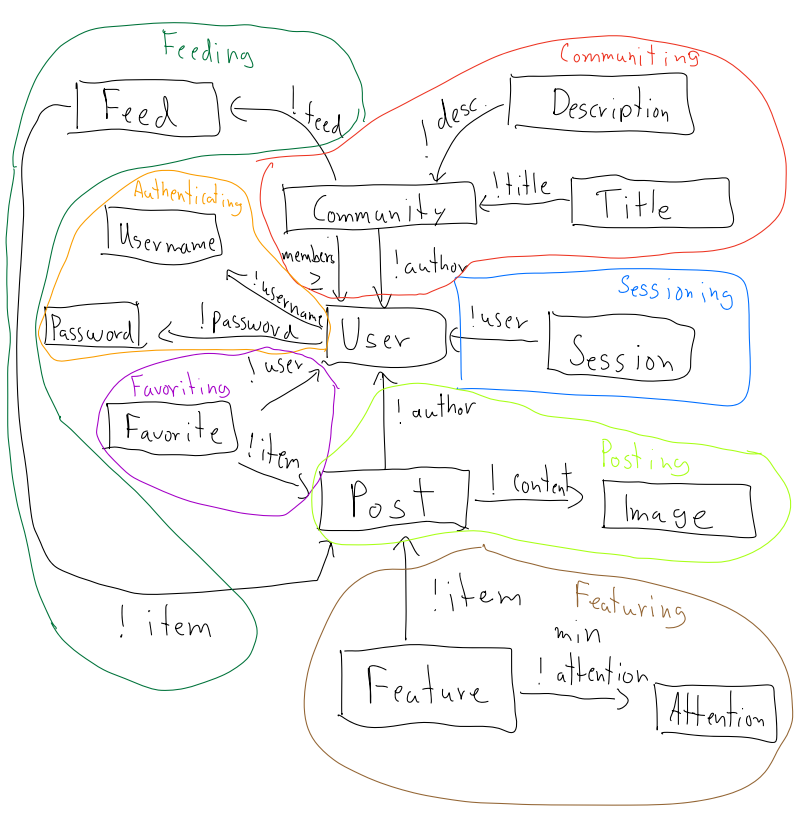

# Assignment 4

---

## Concepts

### Community[User]

**Purpose**

Users can join groups dedicated to a certain topic

**Operation Principle**

A user joins a community about a certain topic with other users that share the same interest.

**State**

    community: One ID
    title: community -> One String
    description: community -> One String
    numMembers: community -> One Integer
    members: community -> Set Users

**Actions**
    create(author: user, title: string, desc: string):
        create new community:= new ID
        communities += community
        community.title := title
        community.description := desc
        community.members := new ID[]
        community.numMembers := 0

    delete(community: ID):
        communities -= community
        community.title := None
        community.description := None
        community.members := None
        community.numMembers := None

    join(member: User, community: ID):
        if member not in community.members:
            community.members += member
            community.numMembers += 1

    leave(member: User, community: ID):
        if member in community.members:
            community.members -= member
            community.numMembers -= 1

### Image Posting[User, Image]

**Purpose**

Users can post images for other users

**Operation Principle**

An user makes a post and other users see the post

**State**

    posts: Set IDs
    content: posts -> One Image
    creator: posts -> One User

**Actions**

    addPost(im: Image, creator: User, out post: ID)
        create new post:= new ID
        posts += post
        post.content := im
        post.creator := creator

        return post

    deletePost(post:ID)
        posts -= post
        post.content := None
        post.creator := None

### Favoriting[Item, User]

**Purpose**

Gives the user a way to express support for an item they liked and saved the item

**Operation Principle**

A user sees an item that they like and so they favorite the item to save it in the platform

**State**

    numFavorites: Item -> One Integer
    favorites: user -> set Items

**Actions**

    favorite(user: User, item: Item):
        item.numFavorites += 1
        user.favorites += item

    unfavorite(user: User, item: Item):
        if item in user.favorites:
            user.favorites -= item
            item.numFavorites -= 1

### Featuring[Item]

**Purpose**

To promote a certain item to multiple users so more users see the item

**Operation Principle**

After an item has gained enough attention from some users, it gets promoted to other users to see

**State**

    attention: One Integer
    promoted: Set Items
    minimumAttention: One Integer

**Actions**

    promote(item: Item, promoted: Items, attention: Integer, out featured: Items):
        if item not in promoted:
            if attention >= minimumAttention:
                promoted += item
        
        return featured
    
    depromote(item: Item, promoted: Items, attention: Integer, out featured: Items):
        if item in promoted:
            if attention < minimumAttention:
                promoted -= item

        return featured

### Sessioning[User]

**Purpose**

To initiate a session in the platform

**Operation Principle**

A user starts a session in the platform and can interact with the platform

**State**

    session: One User
    active: user -> One Boolean

**Action**

    startSession(user: User, out session: User):
        user.active := True
        return user

    endSession():
        if user.active:
            user.active := False

### Authenticating[User]

**Purpose**

To authenticate that the person is in fact a corresponding user in the platform

**Operation Principle**

A person gives a password and a name to get access to a user in the platform with the same name and password

**State**

    users: Set Users
    name: user -> One String
    password: user -> One String

**Actions**

    authenticate(name: String, password: String, out user: User):
        for user in users:
            if user.name == name and user.password == password:
                return user

    register(name: String, password: String):
        if name not in user.name for all user in users:
            user := new User
            user.name := name
            user.password := password
            users += user

### Feeding[Item]

**Purpose**

To group similar items in a singular Feeding

**Operation Principle**

A user sees a feed and looks for items in the feed or adds an item to the feed.

**State**

    feeds: Set IDs
    items: feed -> Set Items

**Actions**
    add(item: Item, feed: ID):
        if item not in feed:
            feed.items += item
    
    delete(item: Item, feed: ID):
        if item in feed:
            feed.items -= item

    getItems(feed: ID):
        return feed.items
---

## App Data Model

    app artBook

        include Authenticating,
        Sessioning[Authenticating.User],
        Posting[Authenticating.User, Image],
        Communiting[Authenticating.User],
        Favoriting[Posting.Post, Authenticating.User],
        Feeding[Communiting.Community, Posting.Post],
        Featuring[Posting.Post]

---

## Diagram

---

## Reflection

While creating the backend, I needed to revisit the concept of Communiting as I left two important actions which are creating and deleting a community. In addition, I felt that the concept itself was too complex, especially having community as also a set of Items. As so, I had two options: either leave as it is, or create a new concept. In the end, I chose to create a new concept Feed that would just manage having this collection of Items. I decided to go for this option as it made the community concept more clear and concise, and having the Feed concept gave me more flexibility for the app.

In summary, developing the backend, gave me appreciation on having clear concepts which before I didn't appreciate it. As such, I made my concepts more concise, either by separating concepts or clearing up definitions.

## [GitHub](https://github.com/devo243/artBook)

## [Deployment](https://art-book.vercel.app/)